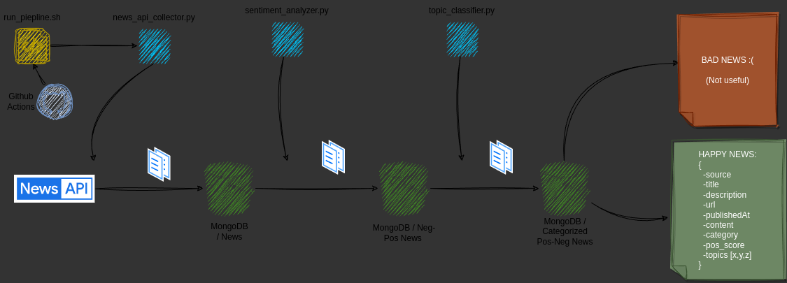

# kindly-positive-feed
Kindly is a open source AI-based feed of positive news from the web

# Project Workflow

## Part 1
TL;DR



## Analysis and Advice for the Project

### Crawler and News Gathering
- **Tools**: For simplicity, use News API and The Guardian API to retrieve articles of the selected categories. Use `requests` and `pymongo` modules.
  - [x] **News API**: retrieve articles from it and push them on MongoDB 'News' collection.
   ~~**The Guardian API**: retrieve articles from it and push them on MongoDB 'News' collection.~~
- **Modularization**
  - [x] `news_api_collector.py` for News API integration.
   ~~`guardian_api_collector.py` for The Guardian API integration.~~
  - [x] `db.py` to handle MongoDB initialization, avoiding code duplication.
- **Unit Tests**:
  - [x] Create `test.py` for testing the collectors.
  - [x] Test `fetch_news` function to ensure it retrieves articles correctly.
  - [x] Test `save_news` function to ensure it only saves unique articles to MongoDB
  
---

### Pre-Processing Pipeline
#### Sentiment Analysis Pipeline
- **Objective**: Analyze each collected article to determine whether its sentiment is positive or negative, and save it in the corresponding MongoDB collection with classification details.
- **Structure and Integration**:
  - [x] Create a `text_analysis/` folder to manage sentiment analysis functionality.
  - [x] Add `sentiment_analyzer.py` to load the pre-trained model from Hugging Face and perform sentiment classification.
  - [x] Integrate `sentiment_analyzer.py` within the article collection pipeline to analyze the sentiment of each article's title and content.
- **Classification Logic**:
  - [x] For each article, perform sentiment analysis using the `distilbert/distilbert-base-uncased-finetuned-sst-2-english` model.
  - [x] If the overall sentiment is positive, save the article in the `positive_news` MongoDB collection. If negative, save it in `negative_news`.
  - [x] Include in MongoDB documents the positive and negative probabilities returned by the model, adding them as `positive_score` and `negative_score` fields for each article.
- **Testing and Maintenance**:
  - [x] Add unit tests (`test_sentiment.py`) to ensure sentiment analysis functions correctly.
  - [x] Document the sentiment analysis and classification pipeline in the README.

#### Topic Classification Pipeline
- **Objective**: Automatically assign topic categories to each article by analyzing its content, allowing the article to be represented by multiple tags.
- **Structure and Integration**:
  - [x] Create a `text_analysis/` folder to manage topic classification functionality.
  - [x] Add `topic_classifier.py` to load the BERTopic model and perform unsupervised topic extraction.
  - [x] Integrate `topic_classifier.py` within the article collection pipeline to analyze topics for each article.
- **Classification Logic**:
  - [x] For each article, extract topics automatically using BERTopic, adding a `topics` field with keywords representing each topic.
  - [x] Insert processed articles into `categorized_positive_news` or `categorized_negative_news` MongoDB collections, depending on their initial sentiment classification, and delete the originals from `positive_news` or `negative_news` collections.
- **Testing and Maintenance**:
  - [ ] Add unit tests (`test_topic_classifier.py`) to ensure topic classification functions correctly.
  - [ ] Document the topic classification pipeline in the README.

---

#### Automation
- **GitHub Actions**:
  - [x] : Create a `piepline.yml` file to automatize news extracion and pipeline execution daily at 12:30 UTC

---

### Database and Storage
- **MongoDB for News**: MongoDB is lightweight, flexible, and handles JSON documents well, perfect for storing unstructured news.
- **PostgreSQL for Users**: Great for storing and managing user data, including interests, feedback, and profiles. PostgreSQL easily supports structured and relational data.
- **Space Limits**: Periodically clean out the database of older news items while maintaining a limited history.

---

# Part 2

### Profiling and Recommendation Algorithm
- [ ] **Collaborative Filtering**: Use lightweight implementations such as Scikit-learn to start. Collect enough user data to achieve good collaborative recommendations.
- [ ] **Feed Customization**: Create an API endpoint where the backend calculates the feed at the time of the request. This enables real-time feed adaptation and transparent model improvements.

---

### Web Extension Frontend
- **React + Tailwind CSS**: Modern and widely used combination for performant, lightweight interfaces. React allows easy modularization of components, like forms and feeds.
- [ ] **Preferences and Interests Collection Form**: Ensure this component is intuitive, so users complete it easily.
- [ ] **Notifications**: Implement a push notification system, e.g., Firebase Cloud Messaging (free up to certain limits).

---

### Extra Features and Optimizations
- [ ] **User Feedback and Machine Learning Explainability**: Use SHAP (SHapley Additive exPlanations) to provide users with insights into why a particular news article was chosen.
- [ ] **NLG for Summaries**: Hugging Face offers models for summarization; a lightweight model like GPT-2 could be suitable.
- [ ] **Social Sharing**: Add a simple button for sharing news on social media directly from the extension.
- [ ] **Mobile Extension**: With React, you could create a mobile app using React Native, allowing reuse of some components.

---

### Running Tests
To run the unit tests for the news collectors:
- set TEST_ENV = true
- run the following command on terminal:
  ```bash
  cd news_collector/
  python -m unittest test.py
  ```